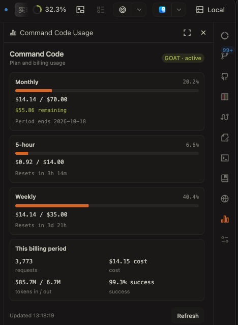

[English](README.md) | [简体中文](README.zh-CN.md) | 日本語

# OpenChamber Command Code Usage

OpenChamber の中で Command Code の使用量を直接確認できる、軽量な拡張機能です。

## プレビュー



## 機能

- プランとアカウントの状態を表示
- 月間の使用額、総額、割合、残りの額、請求期間の終了日を表示
- 5 時間枠と週間枠の使用量、割合、リセット時刻を表示
- 現在の請求期間のリクエスト数、料金、入出力 token 数、成功率を表示
- 手動更新に対応。パネルを開いたときに 1 回更新し、開いている間は 5 分ごとに更新

## 必要条件

- Extension に対応した OpenChamber
- Command Code CLI
- `cmduse`

### macOS のセットアップ

```sh
npm i -g command-code@latest
cmd login
brew install JeffreyJYZ/tap/cmduse
```

CLI が利用できることを確認します。

```sh
cmduse -1 --json
```

## インストール

OpenChamber の実行に必要なビルド済みファイルはリポジトリに含まれています。
Git URL からインストールする場合、OpenChamber は拡張機能のために
`npm install` や TypeScript のビルドを実行しません。そのため、
`panel/main.js` と `service/main.js` をコミットしています。

## OpenChamber へのインストール

1. OpenChamber を開きます。
2. **Settings → Extensions** に移動します。
3. `https://github.com/dai1012/openchamber-commandcode-usage` を貼り付けます。
4. **Add** をクリックします。
5. local service の権限を承認します。

## 仕組み

```text
OpenChamber panel
    ↓
拡張機能の local service
    ↓
cmduse -1 --json
```

パネルは OpenChamber host を通じて拡張機能の local service を呼び出します。
サービスはローカルの `cmduse` 実行ファイルを探して実行し、解析した JSON を
パネルに返します。

## プライバシー / セキュリティ

- 拡張機能は `~/.commandcode/auth.json` を読み取りません。
- Command Code API key を保存しません。
- usage データはローカルの `cmduse -1 --json` コマンドからのみ取得します。
- local service は localhost（`127.0.0.1`）だけで待ち受けます。
- usage データを第三者のサーバーへアップロードしません。
- 実行または JSON 解析に失敗した場合、子プロセスの stdout/stderr は返しません。

## 対応プラットフォーム

検証済み：

- macOS Apple Silicon
- OpenChamber 1.24.x

その他のプラットフォームは、`cmduse` が `PATH` にあるか `CMDUSE_PATH` で設定されて
いれば動作する可能性がありますが、検証済みとはしていません。

## 開発

リポジトリには TypeScript のソース、テスト、OpenChamber に必要なビルド済みファイルが
含まれています。

```sh
npm install
npm test
npm run build
```

`panel/main.js` はブラウザ用の IIFE です。`service/main.js` は OpenChamber の
local-service contract が要求する Node service のエントリーポイントです。
